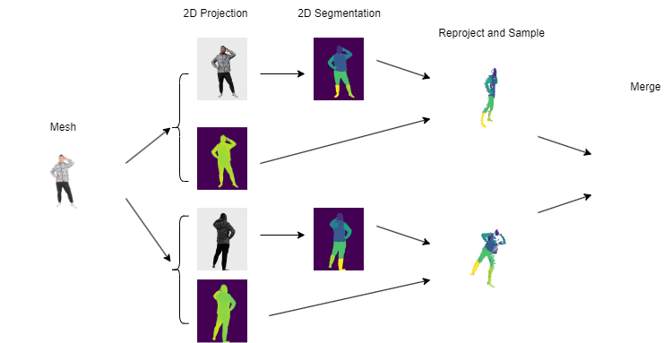

# 3D human parsing via multi-camera 2D analysis and 2D-to-3D reprojection



## Group Members
- Fengze Zhang (fz2244@nyu.edu)
- Chen Yang (cy2478@nyu.edu)
- Enji Hu (eh3094@nyu.edu)
- Mentor: Yueyu Hu (yh3986@nyu.edu)

## Notes
The Jypyter notebook `Experiment.ipynb` is only used to experiment with the SCHP 2D segmentation model. It is not a part of our automated pipeline. However, the code in this notebook is the same as the code in this repository except for minor changes. This notebook has been tested in Colab environment. `OpenModelRefactored.ipynb` is for model projections and was developed in WSL locally. Codes inside can be used to view projection results and 3D segmentation results if collaborating with `Experiment.ipynb`.

Core codes in these two notebooks have been refactored and reorganized to `run_pipeline.py` for an end-to-end operation. `Experiment_Pipeline.ipynb` was executed on Google Colab to check whether the pipeline is working. If the local environment setup fails, `Experiment_Pipeline.ipynb` should be able to provide a way to run our pipeline on Google Colab.

The 3D data we used for testing were provided by our mentor.

Some experiment results can be found under the folder `ExperimentResults`.

## How to Run Our Code
First of all, download this repository to the computer.
```
git clone https://github.com/chris-new/ECE6123-Project.git
cd ECE6123-Project
```

### Environment Setup
Our pipeline is expected to be run on Linux with Python 3.8.

For the 2D segmentation model SCHP, we use the paper authors' implementation. Their implementation requires a GPU to run. Their GitHub repository can be found [here](https://github.com/GoGoDuck912/Self-Correction-Human-Parsing).

Run the following commands to install necessary dependencies.
```
pip install -r requirements.txt
git clone https://github.com/GoGoDuck912/Self-Correction-Human-Parsing.git
```

### Run Pipeline
Make necessary directories for inputs and outputs.
```
mkdir Inputs
mkdir Outputs
```

Put input 3D data under the folder `Inputs`.

Run the Python script.
```
python run_pipeline.py
```
The 2D segmentation masks are saved under the folder `segmentation/2d_outputs`. The output segmented point cloud will be saved under the folder `Outputs` in a `.pcd` binary file that can be read and visualized using `Open3D'.  
